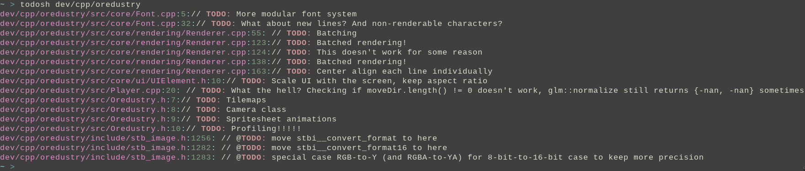

# todosh
Todosh is a useful bash script that outputs lines where `TODO:` or `FIXME:` has occured

# usage
$```todosh <directories>```   

# example


# install
$```sudo curl -o /usr/local/bin/todosh https://raw.githubusercontent.com/rxtthin/todosh/master/todo.sh ; sudo chmod +x /usr/local/bin/todosh```
